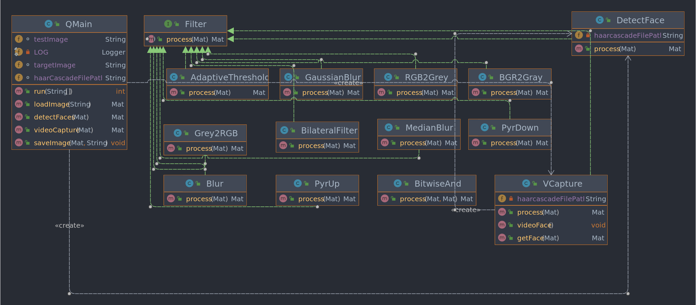

# Quarkus and OpenCV examples

This project uses Quarkus, and a couple of extensions but most importantly the [opencv](https://github.com/quarkiverse/quarkus-opencv) extension from [quarkiverse](https://github.com/quarkiverse/quarkiverse/wiki) 
Its an example project with some filters, and to show how to do it with Quarkus. Its not a full breadth of OpenCV features. The real place to learn OpenCV is [here](https://github.com/opencv/opencv)

If you want to learn more about Quarkus, please visit its website: https://quarkus.io/ .

This repo is not a full blown aṕp. its an example on how one can use Quarkus and OpenCV. Simple examples include filters, operations and further e.g. FaceDetection, Video capture etc. 

### Structure
org.acme.filters ; has all the filters used. These are not all of the filter options in OpenCV and the Kernel in some cases is specific to the use case. e.g. Detecting faces.
org.acme.operations; has one operation in it. i.e. BitwiseAnd. it does not implement the filter interface.


### Writing your own filter
The filter interface takes a Mat image source processes it and returns a Mat image. 
All filters in org.acme.filters implements this interface. Makes it easy to create a FilterConfig and iterate over it. 

```
public interface Filter {

    public Mat process(Mat src);

}
```

QMain is where the examples are loaded up from. Following diagram shows more.



Before running this, make sure you add paths to the application properties.

When you run the QMain (Example main function), currently it uses one filter i.e. Detecfaces
Config files are placed in the conf folder and referred from the application.properties file.

example input and output.

|      Input    | Output |
|:-------------:|-------:|
|   |  |


Thanks to @Michael__Dam for making this photo available freely on [@unsplash]("https://unsplash.com/photos/mEZ3PoFGs_k?utm_source=twitter&utm_medium=referral&utm_content=creditShareLink")


### Running the application in dev mode

You can run your application in dev mode that enables live coding using:
```
./mvnw quarkus:dev
```

### Packaging and running the application

The application can be packaged using `mvn package`.
It produces the `quarkus-opencv-examples-1.0-SNAPSHOT-runner.jar` file in the `/target` directory.
Be aware that it’s not an _über-jar_ as the dependencies are copied into the `target/lib` directory.

The application is now runnable using `java -jar target/quarkus-opencv-examples-1.0-SNAPSHOT-runner.jar`.

### Creating a native executable

You can create a native executable using: `mvn package -Pnative`.

Or, if you don't have GraalVM installed, you can run the native executable build in a container using: `./mvnw package -Pnative -Dquarkus.native.container-build=true`.

You can then execute your native executable with: `./target/quarkus-opencv-examples-1.0-SNAPSHOT-runner`

If you want to learn more about building native executables, please consult https://quarkus.io/guides/building-native-image.
